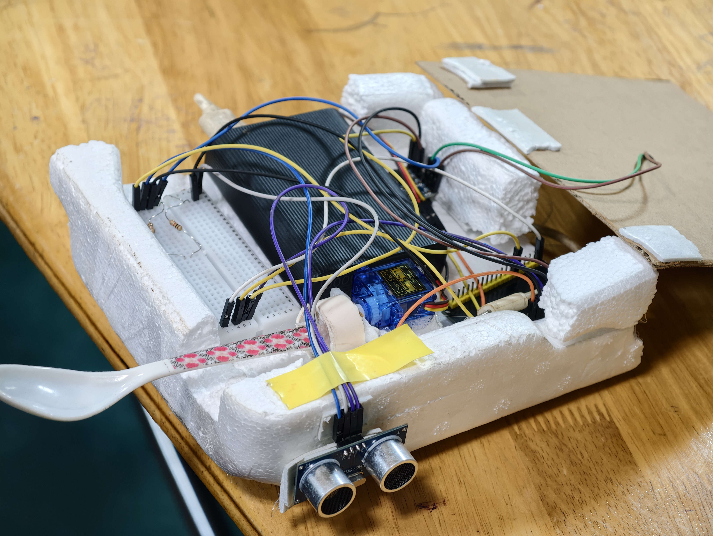

# The Betrayal Spoon 🥄

## Basic Details

### Team Name: Vivet

### Team Members

- Team Lead: Geojin Mathew - Saintgits College of Engineering
- Member 2: Meeval Varghese - Saintgits College of Engineering

### Project Description is as follows 

The Betrayal Spoon is an intentionally useless smart spoon that detects when it approaches the user's mouth and randomly decides whether to spill the food, do nothing, or fake a spill. It uses an ESP32, ultrasonic sensor, servo motor, and audio module to turn a simple eating experience into an unpredictable one.

### The Problem (that doesn't exist)

People have it too easy while eating. Normal spoons are predictable and reliable, so we decided to solve the completely imaginary problem of making eating unnecessarily stressful.

### The Solution (that nobody asked for)

The Betrayal Spoon uses an HC-SR04 ultrasonic sensor to detect when the spoon approaches the user's mouth. The ESP32 then randomly chooses between three outcomes: completely spilling the food, not spilling at all, or performing a fake betrayal without actually spilling. A corresponding meme sound plays to make the experience even worse.

## Technical Details

### Technologies/Components Used

### For Software:

- C/C++
- Arduino IDE
- ESP32 Arduino Core
- ESP32Servo Library
- UART communication
- FN-M16P MP3 command protocol

### For Hardware:

- ESP32
- HC-SR04 Ultrasonic Sensor
- SG90 Servo Motor
- FN-M16P MP3 Audio Module
- 8Ω Speaker
- MicroSD Card
- Spoon
- Resistors
- Jumper wires
- 5V power supply
- Custom handheld enclosure and spoon mechanism

## Implementation

### For Software:

The ESP32 continuously measures the distance using the HC-SR04 ultrasonic sensor. When the detected distance is 10 cm or less, the ESP32 selects one of three outcomes randomly and controls the servo and audio module accordingly.

The three outcomes are:

- Complete Spill — 80%
- No Spill — 10%
- Fake Spill — 10%

### Installation

1. Install the Arduino IDE.
2. Install ESP32 board support in Arduino IDE.
3. Install the ESP32Servo library.
4. Open `The_Betrayal_Spoon.ino`.
5. Select the appropriate ESP32 board and COM port.
6. Upload the code to the ESP32.

### Run

1. Power the ESP32 and connected components.
2. Place food in the spoon.
3. Bring the spoon close to the user's mouth.
4. When the ultrasonic sensor detects a distance of approximately 10 cm or less, the system triggers.
5. The spoon randomly performs one of the three outcomes and plays the corresponding audio.
6. The system waits for the user to move away before allowing another trigger.

## Project Documentation

### For Software:

#### Screenshots

Arduino IDE showing the main control code for the Betrayal Spoon.

Serial Monitor showing the ESP32 detecting distance and triggering the spoon mechanism.

Code section responsible for controlling the FN-M16P audio module and playing the corresponding sound effects.

### Diagrams

Workflow showing how the ultrasonic sensor, ESP32, servo motor, and audio module interact during operation.

### For Hardware:

#### Schematic & Circuit

Circuit diagram showing the connections between the ESP32, HC-SR04 ultrasonic sensor, SG90 servo motor, and FN-M16P audio module.

Hardware schematic showing the electrical connections used in the project.

### Build Photos

Main components used in the project, including the ESP32, ultrasonic sensor, servo motor, FN-M16P audio module, speaker, and supporting components.

The assembly process showing the electronics, servo mechanism, and spoon being integrated into the handheld enclosure.

The completed Betrayal Spoon with the electronics, spoon mechanism, ultrasonic sensor, and audio system assembled together.

## Project Demo

### Video

[Add your demo video link here]

The video demonstrates the completed Betrayal Spoon detecting the user's mouth, randomly selecting an outcome, moving the spoon using the servo, and playing the corresponding meme sound.

### Additional Demos

[Add any additional demo photos, videos, or links here]

## Team Contributions

**Geojin Mathew:** ESP32 programming, ultrasonic sensor integration, servo motor control, FN-M16P audio integration, hardware assembly, testing, and project documentation.

**Meeval Varghese:** Mechanical assembly, spoon mechanism development, hardware integration, testing, project design, and documentation.
    GND
